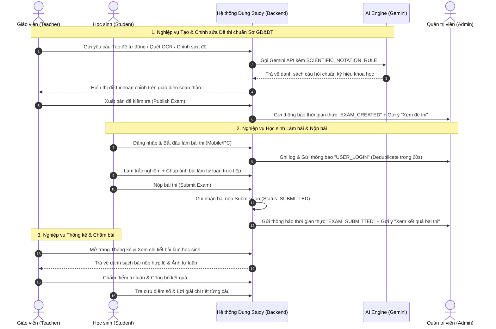
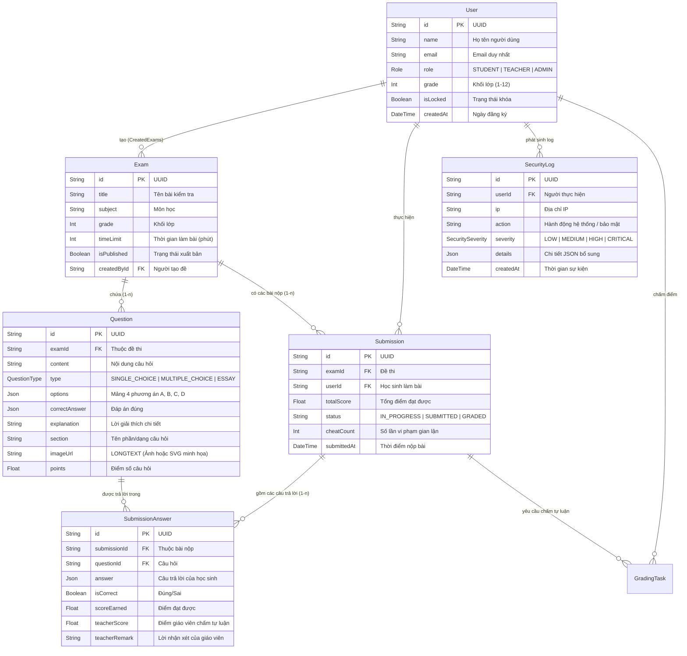

# TỔNG HỢP KẾT QUẢ ĐẠT ĐƯỢC, NGHIỆP VỤ HỆ THỐNG, CÁC ACTOR VÀ MÔ HÌNH THỰC THỂ (DUNG STUDY)

**Dự án:** Hệ thống Học tập & Thi trực tuyến thông minh thông qua AI (Dung Study)  
**Ngày cập nhật mới nhất:** 11/07/2026  
**Đơn vị/Tác giả:** Hệ thống quản lý & Đánh giá năng lực chuẩn Sở GD&ĐT tỉnh Nghệ An  

---

## PHẦN I. TỔNG HỢP TOÀN BỘ KẾT QUẢ ĐẠT ĐƯỢC VÀ CÁC TÍNH NĂNG ĐÃ NÂNG CẤP

Hệ thống đã trải qua quá trình phát triển và hoàn thiện triệt để từ giao diện trải nghiệm người dùng (UI/UX) trên di động và máy tính, cho đến luồng dữ liệu bảo mật và khả năng hỗ trợ AI sâu rộng:

### 1. Nâng cấp Trải nghiệm Làm bài trên Thiết bị Di động & Trình duyệt
- **Giao diện làm bài chuyên biệt cho Mobile (`isMobileMode`)**:
  - Tự động nhận diện thiết bị di động, bố trí lại bố cục thi: Header cố định (`sticky`) hiển thị thời gian làm bài, tiến độ, điểm số và nút Nộp bài rõ ràng.
  - Chuyển toàn bộ danh sách 40 câu hỏi sang dạng **Ngăn kéo Modal câu hỏi (Drawer Modal)** thay vì thanh sidebar chiếm diện tích trang, giúp học sinh mở nhanh danh sách câu hỏi chỉ bằng 1 nút chạm.
  - Bổ sung thanh cuộn ngang cảm ứng (`overflowX: auto`, `-webkit-overflow-scrolling: touch`) cho các thẻ câu hỏi và nội dung hình ảnh, tuyệt đối không bị khuất chữ hay tràn màn hình điện thoại.
- **Giải quyết triệt để mâu thuẫn giữa Chế độ Toàn màn hình (Fullscreen Anti-Cheat) & Nộp bài tự luận**:
  - **Chế độ Camera Live In-App**: Học sinh bấm nút *"📸 Chụp bằng Camera"* ngay dưới câu tự luận để bật camera chụp trực tiếp tờ giấy làm bài mà không cần thoát chế độ toàn màn hình.
  - **Chế độ Ân hạn 90 giây (Whitelist Grace Period)**: Khi học sinh cần tải file ảnh từ máy hoặc bật app máy ảnh, hệ thống hiển thị đếm ngược 90s cho phép chuyển app mà không ghi nhận gian lận.

### 2. Chuẩn hóa & Đảm bảo Chính xác tuyệt đối Thống kê Số liệu
- **Khắc phục sai lệch số liệu Dashboard Giáo viên & Admin ([TeacherStats.jsx](file:///d:/IUH/00.CaNhan/dung-study/src/pages/teacher/TeacherStats.jsx))**:
  - Loại bỏ hoàn toàn tình trạng học sinh mới vào trang hoặc huỷ làm bài giữa chừng bị tính là "đã làm bài".
  - Chỉ thống kê những lượt thi đã nộp thành công (`SUBMITTED` hoặc `GRADED`), hiển thị số liệu chính xác 100% trên các biểu đồ thống kê lượt thi và phân bố điểm số.

### 3. Hệ thống Giám sát Nhật ký Hoạt động & Thông báo Thời gian thực cho Admin
- **Ghi nhận chi tiết Nhật ký Hoạt động & Bảo mật ([SecurityLog](file:///d:/IUH/00.CaNhan/dung-study/server/prisma/schema.prisma#L160-L175))**:
  - Ghi nhận đầy đủ thông tin: Người thực hiện, Địa chỉ IP, Trình duyệt/Thiết bị (`userAgent`), Loại sự kiện (`USER_LOGIN`, `USER_REGISTER`, `EXAM_SUBMITTED`, `EXAM_CREATED`, `BRUTE_FORCE`...), Mức độ nghiêm trọng (`LOW`, `MEDIUM`, `HIGH`, `CRITICAL`).
- **Trung tâm Thông báo Thời gian thực kèm Gợi ý Hành động thông minh cho Admin ([AdminDashboard.jsx](file:///d:/IUH/00.CaNhan/dung-study/src/pages/AdminDashboard.jsx))**:
  - Bất kể Admin đang ở trang nào, khi có hoạt động mới từ người dùng (đăng ký, đăng nhập, nộp bài thi, tạo đề thi, cảnh báo bảo mật...), hệ thống phát chuông và hiển thị thông báo thời gian thực ngay góc trên màn hình.
  - **Gợi ý hành động tức thì theo ngữ cảnh**:
    - Hoạt động làm bài thi (`EXAM_SUBMITTED`) $\rightarrow$ Gợi ý nút **`📄 Xem kết quả bài thi`**.
    - Hoạt động tạo đề thi (`EXAM_CREATED`) $\rightarrow$ Gợi ý nút **`📋 Xem đề thi vừa tạo`**.
    - Hoạt động Đăng nhập/Đăng ký $\rightarrow$ Gợi ý nút **`🔍 Xem chi tiết log`**.
    - Cảnh báo xâm nhập / spam (`HIGH`/`CRITICAL`) $\rightarrow$ Gợi ý nút **`🛑 Chặn IP 30 phút`**.
- **Chống Trùng lặp Thông báo (60s Deduplication Strategy)**:
  - Tự động đối chiếu sự kiện bộ nhớ và cơ sở dữ liệu trong cửa sổ 60 giây, đảm bảo mỗi lượt đăng nhập hay nộp bài chỉ hiển thị đúng **01 thông báo duy nhất**, không bị nhân đôi thông báo.

### 4. Nâng cấp Bộ Quy chuẩn AI Soạn đề, Quét ảnh OCR & Chỉnh sửa Đề thi
- **Quy chuẩn Ký hiệu Khoa học & Toán học Bắt buộc (`SCIENTIFIC_NOTATION_RULE`)**:
  - Bắt buộc toàn bộ luồng tạo đề tự động, phân tích tài liệu Word/PDF, quét ảnh OCR và giải thích đề thi tuyệt đối không viết chữ thay cho ký hiệu (không viết *"căn(x - 2)"*). Bắt buộc hiển thị chuẩn ký hiệu toán học, vật lý, hóa học: `√x`, `x²`, `x³`, `a/b`, `∫`, `lim`, `Σ`, `Δ`, `α`, `β`, `π`, `≤`, `≥`, `≠`, `±`, `∞`, `°C`, `H₂SO₄`, `CO₂`, `Fe²⁺`...
- **Bám sát Cấu trúc & Định hướng Sở GD&ĐT tỉnh Nghệ An**:
  - Ra đề theo ma trận 4 mức độ tư duy (Nhận biết – Thông hiểu – Vận dụng – Vận dụng cao) theo Chương trình GDPT 2018, lồng ghép yếu tố thực tiễn địa phương tỉnh Nghệ An.
- **Tính năng mới: ✨ Chỉnh sửa đề thi bằng AI theo câu lệnh ([ExamForm.jsx](file:///d:/IUH/00.CaNhan/dung-study/src/components/exam/ExamForm.jsx))**:
  - Cho phép giáo viên nhấp nút **`✨ Chỉnh sửa đề bằng AI`** ngay tại trang soạn thảo đề thi, nhập yêu cầu (ví dụ: *"Chuyển các câu hỏi sang mức vận dụng cao hơn"*, *"Chuẩn hóa ký hiệu toán học"*, *"Thêm lời giải chi tiết"*). AI sẽ tự động chỉnh sửa toàn bộ danh sách câu hỏi hiện tại theo đúng yêu cầu.

### 5. Chuẩn hóa Tải về File Word (`.doc`) & In PDF Đẹp mắt
- **Căn lề cân đối chuẩn A4 (`2.5cm` đều 4 bên)**: Cấu hình chuẩn thẻ `@page WordSection1` và container khi xuất ra Word, giúp văn bản cách đều 2 bên, không bị dính sát lề trang.
- **Xóa viền/nét căn của bảng đáp án trắc nghiệm A, B, C, D**: Tự động áp dụng `class="no-border"` loại bỏ mọi nét đứt hay nét viền bảng quanh phương án lựa chọn, hiển thị đề thi trang nhã, đúng phong cách đề thi chính thức.

---

## PHẦN II. CHI TIẾT CÁC ACTOR (TÁC NHÂN) VÀ NGHIỆP VỤ HỆ THỐNG

Hệ thống được thiết kế với **04 Actor chính**, mỗi Actor đảm nhận một bộ vai trò nghiệp vụ (Business Workflows) rõ ràng:

```mermaid
graph TD
    subgraph ACTORS [Các Actor Hệ thống]
        A1(Học sinh - STUDENT)
        A2(Giáo viên - TEACHER)
        A3(Quản trị viên - ADMIN)
        A4((AI Engine - Gemini AI))
    end

    subgraph UC_STUDENT [Nghiệp vụ Học sinh]
        S1[Đăng ký / Đăng nhập tài khoản]
        S2[Tham gia làm bài thi Trắc nghiệm & Tự luận]
        S3[Chụp ảnh bài làm Tự luận trực tiếp / Nộp file ân hạn 90s]
        S4[Xem điểm số, Lời giải chi tiết & Bảng xếp hạng]
    end

    subgraph UC_TEACHER [Nghiệp vụ Giáo viên]
        T1[Soạn đề thi thủ công / Nhập từ Word/PDF]
        T2[Tạo đề tự động bằng AI chuẩn Sở GD&ĐT Nghệ An]
        T3[Chỉnh sửa đề thi bằng AI theo câu lệnh]
        T4[Quét ảnh đề thi OCR bằng AI Vision]
        T5[Quản lý Thống kê & Chấm điểm tự luận học sinh]
        T6[Xuất đề thi & Đáp án chuẩn Word (.doc) / PDF]
    end

    subgraph UC_ADMIN [Nghiệp vụ Quản trị viên]
        AD1[Giám sát tổng quan Dashboard Thời gian thực]
        AD2[Nhận thông báo sự kiện kèm Gợi ý hành động lập tức]
        AD3[Xem chi tiết Nhật ký bảo mật SecurityLog & Lịch sử IP]
        AD4[Quản lý Người dùng, Đề thi & Khóa/Chặn IP vi phạm]
    end

    A1 --> S1 & S2 & S3 & S4
    A2 --> T1 & T2 & T3 & T4 & T5 & T6
    A3 --> AD1 & AD2 & AD3 & AD4
    A4 -. Hỗ trợ ra đề, OCR, Vẽ SVG, Chấm điểm .-> T2 & T3 & T4 & T5
```

### 1. Học sinh (Student Actor)
- **Đặc trưng**: Người học tham gia đánh giá năng lực, khảo sát chất lượng định kỳ theo lớp/trường.
- **Các nghiệp vụ chính**:
  1. **Đăng nhập & Xác thực**: Đăng nhập tài khoản an toàn, tự động thiết lập phiên làm việc.
  2. **Làm bài kiểm tra (Take Exam)**:
     - Thực hiện bài thi trong thời gian quy định với đồng hồ đếm ngược thời gian thực.
     - Tuân thủ cơ chế chống gian lận (Anti-cheat): Giám sát số lần chuyển tab / thoát màn hình toàn phần.
  3. **Nộp bài tự luận thực tiễn**: Sử dụng camera chụp ảnh trực tiếp bài viết giấy ngay trên ứng dụng hoặc dùng chế độ ân hạn 90s tải file ảnh lên.
  4. **Tra cứu kết quả & Lời giải**: Xem điểm số tức thì đối với trắc nghiệm, xem đáp án chi tiết, bảng xếp hạng lớp và lịch sử tiến bộ cá nhân.

### 2. Giáo viên (Teacher Actor)
- **Đặc trưng**: Người quản lý chuyên môn, tổ chức kiểm tra đánh giá và theo dõi chất lượng học sinh.
- **Các nghiệp vụ chính**:
  1. **Tạo & Quản lý đề kiểm tra**:
     - Tạo đề thủ công, nhập câu hỏi trắc nghiệm A/B/C/D và tự luận.
     - Nhận dạng tự động thông tin đề thi (Tên đề, Môn, Khối lớp, Thời gian) khi tải lên tài liệu Word/PDF.
  2. **Trợ lý AI tạo & sửa đề thông minh**:
     - ra đề theo chuẩn ma trận 4 mức độ tư duy (Sở GD&ĐT Nghệ An) và đúng chuẩn ký hiệu khoa học.
     - Quét ảnh đề thi (OCR Vision) chuyển hóa ảnh chụp đề thi thành bộ câu hỏi JSON.
     - Chỉnh sửa đề bằng câu lệnh AI (Sửa độ khó, chuẩn hóa ký hiệu, bổ sung lời giải).
  3. **Giám sát thi & Chấm bài tự luận**:
     - Xem danh sách học sinh đã nộp bài hợp lệ, phát hiện học sinh vi phạm quy chế.
     - Chấm điểm và nhận xét các bài làm tự luận của học sinh (có tham khảo điểm gợi ý từ AI Grader).
  4. **Xuất tài liệu lưu trữ**: Tải đề thi và đáp án chuẩn A4 định dạng Word (`.doc`) lề chuẩn 2.5cm hoặc in PDF chất lượng cao.

### 3. Quản trị viên (Admin Actor)
- **Đặc trưng**: Người điều hành tối cao, đảm bảo an toàn thông tin, giám sát hoạt động toàn hệ thống.
- **Các nghiệp vụ chính**:
  1. **Giám sát Hệ thống & Hoạt động Thời gian thực**:
     - Theo dõi các chỉ số tổng quan: Tổng người dùng, tổng đề thi, lượt làm bài thành công.
  2. **Tiếp nhận Thông báo Thông minh theo Ngữ cảnh**:
     - Nhận thông báo lập tức khi có sự kiện (Đăng nhập, Nộp bài, Tạo đề, Vi phạm bảo mật) kèm các nút Gợi ý hành động nhanh (*Xem kết quả bài thi*, *Xem đề thi*, *Xem log*, *Chặn IP 30 phút*).
  3. **Kiểm soát Nhật ký Bảo mật (Security & Activity Logs)**:
     - Truy vết lịch sử truy cập, địa chỉ IP, User-Agent, phát hiện các nỗ lực xâm nhập bất thường hoặc tấn công gian lận.
  4. **Quản lý Cấu hình & Giao diện**: Quản lý tài khoản người dùng, phân quyền, cấu hình giao diện nền động.

### 4. AI Engine (Gemini AI System Actor)
- **Đặc trưng**: Tác nhân tự động hóa trí tuệ nhân tạo tích hợp sâu trong Backend (`server/routes/ai.js`).
- **Nghiệp vụ**: Soạn câu hỏi theo ma trận, chuyển đổi OCR, vẽ hình minh họa SVG sắc nét, chỉnh sửa đề theo prompt và chấm điểm tự luận tự động.

---

## PHẦN III. MỐI QUAN HỆ GIỮA CÁC ACTOR & BIỂU ĐỒ TƯƠNG TÁC NGHIỆP VỤ

Sơ đồ trình tự dưới đây minh họa luồng tương tác khép kín giữa **Học sinh**, **Giáo viên**, **Hệ thống Dung Study (Backend/Database)**, **AI Engine** và **Quản trị viên**:



---

## PHẦN IV. CHI TIẾT CÁC LỚP THỰC THỂ (DATABASE ENTITY DATA MODEL)

Mô hình dữ liệu của hệ thống được quản lý bằng **Prisma ORM (MySQL)** bao gồm 6 lớp thực thể cốt lõi có mối quan hệ ràng buộc chặt chẽ:



### Chi tiết ý nghĩa nghiệp vụ của từng Lớp Thực thể:

1. **Lớp `User` (Người dùng hệ thống)**:
   - Quản lý định danh và quyền hạn của người dùng (`role`: `STUDENT`, `TEACHER`, `ADMIN`).
   - Liên kết 1-n với các đề thi đã tạo (`Exam`), bài làm đã nộp (`Submission`), và nhật ký hoạt động (`SecurityLog`).

2. **Lớp `Exam` (Đề kiểm tra)**:
   - Quản lý metadata cấu trúc đề thi: `title`, `subject`, `grade`, `timeLimit`, trạng thái xuất bản (`isPublished`), và chế độ đảo câu hỏi/đáp án (`shuffleQuestions`, `shuffleOptions`).

3. **Lớp `Question` (Câu hỏi đề thi)**:
   - Lớp thực thể lưu trữ từng câu hỏi thuộc đề kiểm tra (`examId`).
   - Hỗ trợ phân loại linh hoạt (`type`): Trắc nghiệm một đáp án (`SINGLE_CHOICE`), Trắc nghiệm nhiều đáp án (`MULTIPLE_CHOICE`), và Tự luận (`ESSAY`).
   - Trường `imageUrl` với kiểu dữ liệu `LONGTEXT` cho phép lưu trữ liên kết hoặc ảnh Base64/SVG độ phân giải cao mà không bị giới hạn bộ nhớ.

4. **Lớp `Submission` (Bài làm nộp của học sinh)**:
   - Ghi nhận mỗi lượt thi của học sinh trên một đề thi cụ thể.
   - Quản lý tính xác thực bài thi: Lưu trạng thái thi (`status`: `SUBMITTED`/`GRADED`), địa chỉ IP, thiết bị thi và đặc biệt là số lần vi phạm gian lận thoát màn hình (`cheatCount`, `cheatLogs`).

5. **Lớp `SubmissionAnswer` (Chi tiết câu trả lời từng câu)**:
   - Lưu câu trả lời cụ thể của học sinh cho từng câu hỏi (`questionId`), ghi nhận điểm tự động của hệ thống (`scoreEarned`, `isCorrect`) hoặc điểm số/nhận xét từ Giáo viên chấm tự luận (`teacherScore`, `teacherRemark`).

6. **Lớp `SecurityLog` (Nhật ký An toàn & Hoạt động hệ thống)**:
   - Lớp thực thể đóng vai trò cốt lõi trong hệ thống giám sát và thông báo Admin thời gian thực.
   - Lưu trữ hành động (`action`), mức độ nghiêm trọng (`severity`), địa chỉ IP truy cập và chi tiết metadata ngữ cảnh phục vụ deduplication thông báo và phân tích bảo mật.

---
*Tài liệu này là chuẩn nghiệp vụ chính thức cho toàn bộ kiến trúc hệ thống Dung Study.*
